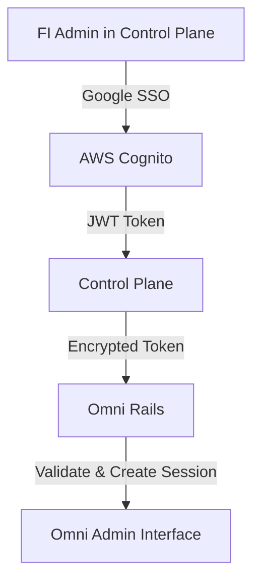

# SSO Integration POC: Control Plane to Omni Authentication

## Overview

This POC demonstrates the successful integration of SSO authentication between the Control Plane (Node.js) and Omni (Rails) applications, specifically focusing on the FI Admin authentication flow using Google SSO via AWS Cognito.

## Business Context

### Current State

- Control Plane serves as the unified hub for nCino offerings
- Omni (Rails) handles multiple business lines:
  - Consumer Banking
  - Small Business
  - Commercial Banking
- Currently, Omni uses a Super Admin model without FI Admin distinction

### Target State

- Seamless SSO between Control Plane and Omni
- FI Admin access to Omni through Control Plane
- Scalable solution for future business lines
- Proper role separation (FI Admin vs Super Admin)

## POC Implementation

### 1. Architecture Mapping

#### Control Plane (Node.js) → SSO Service (TypeScript)

- Our TypeScript SSO service represents the Control Plane's authentication component
- Implements token generation and encryption for secure transmission
- Uses Google SSO via AWS Cognito for FI Admin authentication

#### Omni (Rails) → Rails SSO Module

- Implemented as the authentication endpoint in Omni
- Handles encrypted token validation and user session management
- Creates or updates FI Admin sessions based on SSO claims

### 2. Authentication Flow



### 3. Key Components Demonstrated

#### a. Token Generation & Security

- JWT tokens contain FI Admin claims from Google SSO
- AES-256-GCM encryption for secure token transmission
- RSA-256 for JWT signature verification

#### b. User Synchronization

- FI Admin details synchronized from Control Plane to Omni
- Session management with proper timeout handling
- Role-based access control foundation

## Successful Implementation Highlights

1. **Authentication Flow** ✅

   - Complete flow from Google SSO → Control Plane → Omni
   - Secure token transmission with encryption
   - Proper session management

2. **Security Measures** ✅

   - AES-256-GCM encryption for tokens
   - JWT validation with proper issuer/audience checks
   - Secure key management via environment variables

3. **User Management** ✅
   - Successful user synchronization
   - Session creation and validation
   - Foundation for FI Admin role separation

## Production Considerations

### 1. Encryption Key Management

- **Current (POC)**: Environment variables
- **Production Recommendation**: AWS KMS
  ```typescript
  // Example KMS integration
  const kms = new AWS.KMS();
  const encryptionKey = await kms
    .decrypt({
      KeyId: "alias/omni-sso-key",
      CiphertextBlob: Buffer.from(encryptedKey, "base64"),
    })
    .promise();
  ```

### 2. Scaling Considerations

- Implement proper key rotation mechanisms
- Add monitoring for authentication failures
- Set up proper logging and alerting
- Consider rate limiting for token endpoints

### 3. Multi-Business Line Support

- Token claims should include business line information
- Implement role-based access control in Omni
- Consider separate encryption keys per business line

## Next Steps

1. **Infrastructure**

   - Set up AWS KMS for encryption key management
   - Implement proper key rotation policies
   - Configure production-grade monitoring

2. **Application Changes**

   - Implement FI Admin role separation in Omni
   - Add business line context to tokens
   - Set up proper audit logging

3. **Security Enhancements**
   - Add rate limiting
   - Implement token revocation
   - Set up security monitoring and alerting

## Conclusion

The POC successfully demonstrates the feasibility of integrating Control Plane's SSO with Omni, providing a secure and scalable foundation for FI Admin access. Key achievements:

1. **Authentication**: Secure SSO flow from Google → Control Plane → Omni
2. **Security**: Proper encryption and token validation
3. **Scalability**: Foundation for multi-business line support

For production deployment, the primary focus should be on:

1. Moving encryption key management to AWS KMS
2. Implementing proper monitoring and alerting
3. Adding business line context and role separation

The implementation provides a solid foundation for scaling to additional business lines while maintaining security and manageability.
